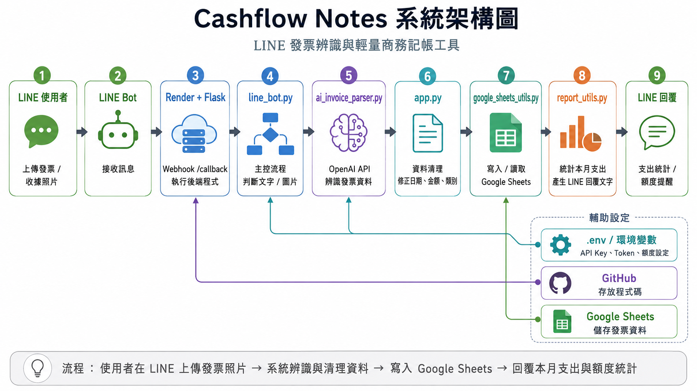
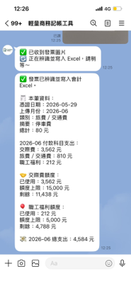
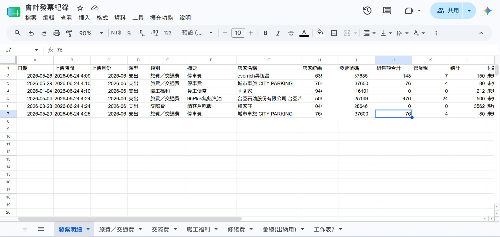

# Cashflow Notes｜LINE 發票辨識與輕量商務記帳工具

Cashflow Notes 是一個以 LINE Bot 為操作介面的輕量商務記帳工具。使用者只需要在 LINE 上傳發票或收據照片，系統就會透過 OpenAI API 進行圖片辨識，擷取日期、店家名稱、統編、發票號碼、金額與費用類別，並自動寫入 Google Sheets。

本專案整合 Python、Flask、LINE Messaging API、OpenAI API、Google Sheets API 與 Render 部署，目標是降低小型商家、業務人員與非專職會計人員整理憑證的時間成本。

---

## 專案成果展示

### 系統架構圖



### LINE 操作 Demo

使用者在 LINE 上傳發票或收據照片後，系統會自動辨識內容，並回覆本月支出統計與費用額度使用狀況。



### Google Sheets 寫入結果

AI 辨識與資料清理完成後，系統會將發票資料自動寫入 Google Sheets，方便後續查詢、彙整與會計整理。



---

## 專案亮點

* 使用 LINE Bot 作為操作介面，降低使用門檻。
* 使用 OpenAI API 進行發票與收據圖片辨識。
* 自動擷取日期、店家名稱、店家統編、發票號碼、金額與費用類別。
* 將辨識後的資料寫入 Google Sheets，方便後續會計整理。
* 即時回覆本月總支出、各類別支出與費用額度使用狀況。
* 使用 Render 部署 Flask 後端，讓 LINE Bot 可以在線上持續運作。
* 採用模組化設計，將 LINE 接收、AI 辨識、資料清理、Google Sheets 寫入與統計回覆拆分成不同程式檔案。

---

## 專案動機

在小型商家、業務人員或非專職會計人員的日常工作中，發票與收據常常需要事後整理。傳統方式通常需要手動輸入日期、金額、店家與費用類別，不僅耗時，也容易出錯。

因此，本專題希望建立一個簡單、直覺且可即時使用的記帳工具。使用者不需要開啟 Excel 或會計系統，只要透過 LINE 上傳照片，系統就能自動辨識發票資料、寫入 Google Sheets，並回覆支出統計結果。

---

## 使用情境

本工具適合以下情境：

* 業務人員整理客戶拜訪、交通、停車、餐飲等費用。
* 小型商家記錄日常營運支出。
* 非專職會計人員快速整理發票與收據資料。
* 需要將憑證資料集中到 Google Sheets 給會計檢查。
* 希望透過 LINE 即時掌握本月支出與額度使用狀況。

---

## 系統流程

```text
LINE 使用者
   │
   │ 上傳發票 / 收據照片
   ▼
LINE Bot
   │
   │ LINE Webhook
   ▼
Render + Flask
   │
   │ 接收 /callback 請求
   ▼
line_bot.py
   │
   │ 接收訊息、下載圖片、控制流程
   ▼
ai_invoice_parser.py
   │
   │ 呼叫 OpenAI API 辨識發票圖片
   ▼
app.py
   │
   │ 清理資料、修正格式與類別
   ▼
google_sheets_utils.py
   │
   │ 寫入 / 讀取 Google Sheets
   ▼
report_utils.py
   │
   │ 統計本月支出並產生 LINE 回覆文字
   ▼
LINE Bot 回覆使用者
```

---

## 主要功能

### 1. LINE 發票上傳

使用者可以直接在 LINE Bot 中上傳發票或收據照片。系統會接收圖片訊息，並將圖片交給後端程式處理。

### 2. AI 發票圖片辨識

系統會透過 OpenAI API 辨識圖片中的發票資訊，包含：

* 日期
* 類型
* 費用類別
* 摘要
* 店家名稱
* 店家統編
* 發票號碼
* 銷售額合計
* 營業稅
* 總計
* 付款方式
* 是否需要人工確認

### 3. 資料清理與格式修正

AI 回傳的資料可能會有格式不一致或欄位缺漏，因此系統會進行資料清理，例如：

* 將民國日期轉換成西元日期。
* 將金額轉換成數字格式。
* 檢查店家統編是否為 8 位數字。
* 檢查發票號碼是否符合 2 碼英文加 8 碼數字。
* 根據摘要與交易明細修正費用類別。

### 4. Google Sheets 自動寫入

整理後的發票資料會自動寫入 Google Sheets，作為後續查詢、統計與會計整理使用。

### 5. 本月支出統計

系統會讀取 Google Sheets 中的既有資料，計算：

* 本月總支出
* 各費用類別支出
* 交際費已使用額度
* 交際費剩餘額度
* 職工福利已使用額度
* 職工福利剩餘額度

### 6. LINE 即時回覆

發票寫入成功後，系統會將統計結果整理成文字，回覆到 LINE 聊天室，讓使用者可以即時掌握目前支出狀況。

---

## 專案檔案結構

```text
receipt-line-bot/
│
├── README.md
├── requirements.txt
├── .gitignore
│
├── line_bot.py
├── ai_invoice_parser.py
├── app.py
├── google_sheets_utils.py
├── report_utils.py
│
├── images/
│   ├── architecture.png
│   ├── line-demo.png
│   └── google-sheet-demo.png
│
└── docs/
    └── 李沛芸_Cashflow Notes 輕量商務記帳工具.pptx
```

---

## 程式模組說明

### `line_bot.py`

主控程式，負責接收 LINE Webhook 傳來的訊息，判斷使用者傳的是文字還是圖片，並串接後續流程。

主要工作包含：

* 建立 Flask Webhook 接收入口。
* 接收 LINE 訊息事件。
* 判斷文字訊息或圖片訊息。
* 下載使用者上傳的圖片。
* 呼叫 AI 辨識模組。
* 呼叫資料清理模組。
* 呼叫 Google Sheets 寫入模組。
* 呼叫統計回覆模組。
* 將結果回覆給 LINE 使用者。

### `ai_invoice_parser.py`

AI 發票辨識模組，負責將發票或收據圖片傳送給 OpenAI API，並取得發票資料。

主要工作包含：

* 接收圖片檔案路徑。
* 將圖片轉換成 base64 格式。
* 設定發票辨識提示詞。
* 呼叫 OpenAI API。
* 要求 AI 回傳固定 JSON 格式。
* 將 AI 回傳文字轉換成 Python dictionary。

### `app.py`

資料清理模組，負責整理 AI 回傳的發票資料。

主要工作包含：

* 統一日期格式。
* 統一金額格式。
* 檢查統編格式。
* 檢查發票號碼格式。
* 修正費用類別。
* 補上預設欄位。
* 回傳可寫入 Google Sheets 的標準資料。

### `google_sheets_utils.py`

Google Sheets 資料存取模組，負責連接 Google Sheets，並寫入或讀取發票資料。

主要工作包含：

* 讀取 Google Service Account 金鑰。
* 建立 Google Sheets API 連線。
* 開啟指定 Google 試算表。
* 選擇指定工作表。
* 確認欄位標題。
* 新增一筆發票紀錄。
* 讀取既有發票資料供統計使用。

### `report_utils.py`

統計與回覆模組，負責產生 LINE 回覆文字。

主要工作包含：

* 篩選本月資料。
* 計算本月總支出。
* 統計各費用類別支出。
* 計算交際費額度使用狀況。
* 計算職工福利額度使用狀況。
* 組合 LINE 回覆文字。

---

## 使用到的套件

| 套件              | 用途                               |
| --------------- | -------------------------------- |
| `flask`         | 建立後端伺服器，接收 LINE Webhook          |
| `gunicorn`      | 讓 Flask 可以在 Render 上正式執行         |
| `line-bot-sdk`  | 接收 LINE 訊息、圖片，並回覆使用者             |
| `openai`        | 呼叫 OpenAI API 進行發票圖片辨識           |
| `python-dotenv` | 本機開發時讀取 `.env` 設定                |
| `pandas`        | 處理表格資料與支出統計                      |
| `gspread`       | 使用 Python 操作 Google Sheets       |
| `google-auth`   | 使用 Google Service Account 進行身分驗證 |
| `openpyxl`      | 讀寫 Excel 檔案，早期本機版本使用             |

---

## 使用到的技術

| 技術                     | 用途                       |
| ---------------------- | ------------------------ |
| Python                 | 後端程式主要開發語言               |
| Flask                  | 建立 Webhook 接收入口          |
| LINE Bot               | 使用者操作介面                  |
| LINE Webhook           | 將使用者訊息轉送到後端              |
| OpenAI API             | 辨識發票圖片並擷取資料              |
| Google Sheets API      | 寫入與讀取發票資料                |
| Google Service Account | 讓程式取得 Google Sheets 存取權限 |
| GitHub                 | 存放與管理程式碼                 |
| Render                 | 部署與執行後端程式                |
| Environment Variables  | 存放 API Key、Token 與機密設定   |

---

## Google Sheets 欄位設計

| 欄位名稱      | 說明                     |
| --------- | ---------------------- |
| 日期        | 發票或收據上的憑證日期            |
| 上傳時間      | 使用者上傳圖片的時間             |
| 上傳月份      | 依照上傳時間產生的月份，用於本月統計     |
| 類型        | 支出或收入，目前主要為支出          |
| 類別        | 費用分類，例如交際費、職工福利、旅費／交通費 |
| 摘要        | 此筆消費內容簡述               |
| 店家名稱      | 發票上的店家或營業人名稱           |
| 店家統編      | 賣方統一編號                 |
| 發票號碼      | 統一發票號碼                 |
| 銷售額合計     | 未稅金額                   |
| 營業稅       | 稅額                     |
| 總計        | 含稅總金額                  |
| 付款方式      | 現金、信用卡、LINE Pay 等      |
| 憑證圖片路徑    | 圖片儲存路徑                 |
| 資料來源      | 例如 AI 圖片辨識             |
| 需人工確認     | 標示是否需要人工檢查             |
| LINE使用者ID | 上傳者的 LINE 使用者 ID       |

---

## 環境變數設定

本機開發時，可在 `.env` 中設定以下內容：

```env
OPENAI_API_KEY=你的 OpenAI API Key
LINE_CHANNEL_ACCESS_TOKEN=你的 LINE Channel Access Token
LINE_CHANNEL_SECRET=你的 LINE Channel Secret

GOOGLE_SHEET_NAME=會計發票紀錄
GOOGLE_WORKSHEET_NAME=發票明細
GOOGLE_SERVICE_ACCOUNT_JSON=你的 Google Service Account JSON

ENTERTAINMENT_BUDGET=10000
WELFARE_BUDGET=5000
```

正式部署到 Render 時，以上資料應設定在 Render 的 Environment Variables，不要上傳 `.env` 到 GitHub。

---

## 部署方式

### 1. 上傳程式碼到 GitHub

正式檔案包含：

```text
.gitignore
README.md
requirements.txt
ai_invoice_parser.py
app.py
google_sheets_utils.py
line_bot.py
report_utils.py
```

不要上傳：

```text
.env
receipts/
exports/
__pycache__/
*.jpg
*.png
*.xlsx
Google Service Account JSON 檔案
```

### 2. 在 Render 建立服務

Render 設定範例：

```text
Build Command:
pip install -r requirements.txt

Start Command:
gunicorn line_bot:app
```

### 3. 設定 Render Environment Variables

在 Render 後台設定：

```text
OPENAI_API_KEY
LINE_CHANNEL_ACCESS_TOKEN
LINE_CHANNEL_SECRET
GOOGLE_SHEET_NAME
GOOGLE_WORKSHEET_NAME
GOOGLE_SERVICE_ACCOUNT_JSON
ENTERTAINMENT_BUDGET
WELFARE_BUDGET
```

### 4. 設定 LINE Webhook URL

在 LINE Developers 中設定 Webhook URL：

```text
https://你的-render-網址.onrender.com/callback
```

---

## 模組化設計說明

本專案採用模組化設計，將不同功能拆成多個 Python 檔案，而不是全部寫在同一個檔案中。

模組分工如下：

```text
line_bot.py              主控流程
ai_invoice_parser.py     AI 發票辨識
app.py                   資料清理
google_sheets_utils.py   Google Sheets 寫入與讀取
report_utils.py          支出統計與 LINE 回覆
```

這樣設計的優點包括：

* 程式結構更清楚。
* 每個檔案只負責一種主要功能。
* 出錯時比較容易找到問題。
* 後續維護與修改更方便。
* 未來可以更容易擴充新功能。

---

## 未來優化方向

未來可以持續擴充以下功能：

* 增加更多費用類別與自訂分類規則。
* 加入人工確認介面，讓使用者可以修改辨識錯誤的資料。
* 支援查詢指定月份支出。
* 支援匯出月報表或會計用 Excel。
* 加入發票重複檢查，避免同一張發票重複寫入。
* 增加多使用者帳號管理。
* 建立 Power BI 或 Looker Studio 儀表板。
* 加入預算提醒與異常支出提醒。

---

## 專案總結

Cashflow Notes 透過 LINE Bot、OpenAI API 與 Google Sheets，將發票記帳流程從手動輸入轉為自動化處理。使用者只需要上傳照片，系統即可完成圖片辨識、資料清理、表格寫入與即時統計回覆。

本專案展示了 Python 在後端開發、API 串接、資料清理、自動化寫入與雲端部署上的整合能力，也具備實際商務應用情境。
